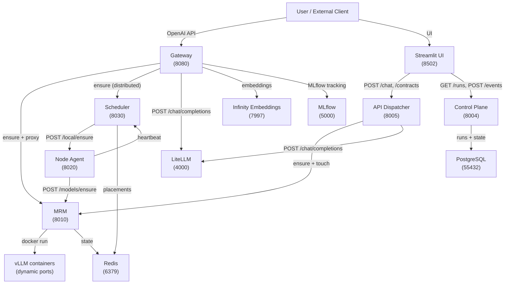

# System Architecture

Distributed AI inference orchestration platform. Manages model lifecycle on GPU hardware, routes inference requests, and orchestrates fine-tuning pipelines.

---

## System Overview



---

## Services

### Gateway — `gateway/` (Port 8080)

**Role:** OpenAI-compatible inference endpoint. Single entry point for external API consumers.

**Owns:** Request routing, instance selection, streaming proxy.

**Does NOT own:** Model lifecycle, placement decisions, training.

### Endpoints

| Method | Path | Purpose |
|--------|------|---------|
| POST   | `/v1/chat/completions` | Inference (unary + streaming) |
| GET    | `/v1/models`           | List available models from MRM |
| POST   | `/v1/embeddings`       | Text embeddings via Infinity |
| GET    | `/health`              | Liveness probe |
| GET    | `/ready`               | Readiness probe |
| GET    | `/v1/router/metrics`   | Per-instance routing stats |
| GET    | `/metrics`             | Prometheus metrics |

**Request flow:**
1. `POST /v1/chat/completions` received
2. Call `MRM /models/ensure` (or `Scheduler /schedule/ensure` if `use_scheduler=True`)
3. Select instance via `ModelRouter` (least_loaded / round_robin / random)
4. Forward request to `vLLM api_base` via httpx proxy
5. Stream or buffer response; record MLflow metrics fire-and-forget

**Config (env vars):**
- `GATEWAY_MRM_URL` — MRM endpoint
- `GATEWAY_USE_SCHEDULER` — toggle distributed mode
- `GATEWAY_SCHEDULER_URL` — scheduler endpoint
- `GATEWAY_ROUTING_STRATEGY` — `least_loaded` | `round_robin` | `random`
- `GATEWAY_OTEL_ENDPOINT` — Jaeger OTLP endpoint
- `LOG_FORMAT` — `json` | `console`

---

### Scheduler — `scheduler/` (Port 8030)

**Role:** Multi-node placement broker. Decides which node hosts which model.

**Owns:** `NodeRegistry` (live nodes), `PlacementStore` (model→node mapping).

**Does NOT own:** Container lifecycle, GPU hardware, routing strategies.

**Redis schema:**
```
scheduler:nodes                  — set of live node_ids
scheduler:node:{node_id}         — node metadata + last_heartbeat (TTL: node_ttl_sec)
scheduler:placement:{model_id}   — placement record (node_id, api_base, instance_id)
scheduler:node_models:{node_id}  — set of models placed on this node
```

### Endpoints

| Method | Path | Purpose |
|--------|------|---------|
| POST   | `/schedule/ensure`  | Place model on a node, return api_base |
| POST   | `/schedule/stop`    | Release model placement |
| POST   | `/nodes/heartbeat`  | Register or refresh node |
| GET    | `/nodes`            | List alive nodes |
| GET    | `/health`           | Liveness probe |
| GET    | `/metrics`          | Prometheus metrics |

**Per-model asyncio lock:** prevents concurrent placement of the same model on multiple nodes.

**Config (env vars):**
- `SCHEDULER_REDIS_URL`
- `SCHEDULER_NODE_TTL_SEC` — node expiry after missed heartbeats
- `SCHEDULER_PLACEMENT_TTL_SEC` — placement expiry
- `SCHEDULER_PLACEMENT_STRATEGY` — `least_loaded` | `random`
- `SCHEDULER_OTEL_ENDPOINT`

---

### Node Agent — `node_agent/` (Port 8020)

**Role:** Per-GPU-server sidecar. Bridges Scheduler commands to the local MRM.

**Owns:** Nothing. Pure delegation layer.

**Does NOT own:** Placement decisions, container lifecycle (that's MRM).

**Responsibilities:**
- Push heartbeat to Scheduler every N seconds (self-registration with GPU state)
- Forward `/local/ensure` → local MRM `/models/ensure`
- Forward `/local/stop` → local MRM `/models/stop`
- Report GPU free/total/used MB via pynvml

### Endpoints

| Method | Path | Purpose |
|--------|------|---------|
| POST   | `/local/ensure` | Forward ensure to local MRM |
| POST   | `/local/stop`   | Forward stop to local MRM |
| GET    | `/health`       | Liveness probe |
| GET    | `/metrics`      | Prometheus metrics |

**Config (env vars):**
- `NODE_AGENT_NODE_ID` — unique node identifier
- `NODE_AGENT_MRM_URL` — local MRM endpoint
- `NODE_AGENT_SCHEDULER_URL` — scheduler to register with
- `NODE_AGENT_HEARTBEAT_INTERVAL_SEC`
- `NODE_AGENT_OTEL_ENDPOINT`

---

### Model Runtime Manager (MRM) — `model_runtime_manager/` (Port 8010)

**Role:** Authoritative lifecycle manager for vLLM Docker containers and GPU resources.

**Owns:** Docker container lifecycle, GPU slot allocation, model runtime state.

**Does NOT own:** Routing, placement across nodes, training.

**Redis schema (canonical truth):**
```
mrm:model:{base_model}   — state: ABSENT|STARTING|READY|STOPPING
mrm:gpu:{gpu_index}      — occupied_by (model_id or null)
mrm:lock:{base_model}    — distributed lock (prevents concurrent operations)
```

**State machine:**
```
ABSENT → STARTING → READY → STOPPING → ABSENT
```

### Endpoints

| Method | Path | Purpose |
|--------|------|---------|
| POST   | `/models/ensure`    | Guarantee model is READY (start if needed) |
| POST   | `/models/touch`     | Update last_used (prevent idle eviction) |
| POST   | `/models/stop`      | Stop container, release GPU |
| POST   | `/models/remove`    | Remove container, clear all state |
| GET    | `/models/status`    | All model states |
| POST   | `/factory/provision`| Auto-register and start models |
| POST   | `/litellm/config`   | Generate LiteLLM YAML from live models |
| GET    | `/health`           | Liveness probe |

**Key invariant:** Docker is a sensor. Redis is truth. MRM reconciles divergence.

**Config (env vars):**
- `MRM_REDIS_URL`
- `MRM_IDLE_TIMEOUT_SEC` — evict models unused for N seconds
- `MRM_DOCKER_NETWORK` — Docker network for vLLM containers
- `HF_TOKEN` — HuggingFace auth
- `LITELLM_CONFIG_PATH`

---

### API Dispatcher — `api/` (Port 8005)

**Role:** Execution bridge for the training/fine-tuning pipeline. Routes requests from UI to workers, materializes LoRA adapters, injects RAG context.

**Owns:** LoRA adapter materialization, RAG context assembly, training job routing.

**Does NOT own:** Model lifecycle (delegates to MRM), orchestration policy (delegates to Control Plane), placement (delegates to MRM).

### Endpoints

| Method | Path | Purpose |
|--------|------|---------|
| POST   | `/chat`           | Chat with LoRA + RAG support |
| POST   | `/dataset/build`  | Trigger dataset construction |

**Request flow for `/chat`:**
1. Resolve `base_model` from request
2. `MRM /models/ensure` → get `api_base` + `model_alias`
3. `MRM /models/touch`
4. Materialize LoRA adapter from S3 if `run_id` provided
5. Retrieve RAG context from Neo4j if `use_rag=True`
6. Forward to `LiteLLM /v1/chat/completions`

**Config (env vars):**
- `MRM_URL`
- `CONTROL_PLANE_URL`
- `VLLM_API_BASE` (fallback)
- `AWS_BUCKET_NAME`, `AWS_ACCESS_KEY_ID`, `AWS_SECRET_ACCESS_KEY`
- `NEO4J_URI`, `NEO4J_USER`, `NEO4J_PASSWORD`

---

### Control Plane — `control_plane/` (Port 8004)

**Role:** Policy engine and single source of orchestration truth. Decides what happens next; never executes.

**Owns:** `Run` lifecycle, contract validation, state machine, event history.

**Does NOT own:** Execution, model containers, training workers.

**Core entity — `Run`:**
```
Run {
  id: UUID (immutable)
  contract_type: str  (dataset.build.v1 | train.qlora.v1 | train.dpo.v1 | eval.standard.v1)
  contract: JSON      (versioned intent payload)
  state: RunState
  events: [Event]     (append-only fact log)
  artifacts: JSON     (output paths, model IDs, metrics)
}
```

**State machine:**
```
CREATED → DATASET_RUNNING → DATASET_READY → TRAIN_RUNNING → TRAIN_READY → DONE
                                                                         ↘ FAILED (any transition)
```

### Endpoints

| Method   | Path               | Purpose |
|----------|--------------------|---------|
| POST     | `/contracts`       | Submit intent → create Run |
| POST     | `/events`          | Record fact (worker reports completion) |
| GET      | `/runs`            | List runs |
| POST     | `/runs/{id}/action`| Query next action for a run |
| GET/POST | `/prompts`         | Prompt management |

**Config (env vars):**
- `DATABASE_URL` — PostgreSQL async DSN
- `DISPATCHER_URL` — to call the Dispatcher

---

### Frontend — `frontend/` (Port 8502)

**Role:** Internal operator UI. Not a user-facing product interface.

**Accesses:** Control Plane (runs, contracts), API Dispatcher (chat, dataset build), MRM (model status).

**Does NOT own:** Any state. Pure display and interaction layer.

**Pages:**
- `home` — system overview
- `chat` — inference with LoRA + RAG support
- `orchestration` — submit contracts, view run states
- `training` / `dataset_build` — pipeline submission UIs
- `model_registry` — register new models
- `gpu_monitor` — real-time GPU utilization
- `hf_registry` — browse HuggingFace catalog
- `prompt_studio` — prompt management
- `deployment_manager` — container management

---

## Data Flow

### Inference Request (Single-Node)

```
Client
  │ POST /v1/chat/completions
  ▼
Gateway (8080)
  │ POST /models/ensure {base_model}
  ▼
MRM (8010)
  │ Checks Redis mrm:model:{base_model}
  │ Starts vLLM container if ABSENT
  │ Returns {model_alias, api_base, gpu, state: READY}
  ▼
Gateway
  │ Selects instance via ModelRouter
  │ POST {api_base}/chat/completions (httpx proxy)
  ▼
vLLM container
  │ Inference
  ▼
Gateway → Client (stream or buffered)
  │ MLflow.log_metrics (fire-and-forget)
```

### Inference Request (Distributed)

```
Client
  │ POST /v1/chat/completions
  ▼
Gateway (8080)
  │ POST /schedule/ensure {model_id}
  ▼
Scheduler (8030)
  │ Checks PlacementStore (cache hit → return immediately)
  │ On miss: selects node via PlacementStrategy
  │ POST {node_agent_url}/local/ensure
  ▼
Node Agent (8020)
  │ POST {mrm_url}/models/ensure
  ▼
MRM (8010) → vLLM container
  │ Returns {api_base, model_alias}
  ▼
Scheduler → Gateway → Client
```

### Training Pipeline

```
UI (8502)
  │ POST /contracts {type: "train.qlora.v1", contract: {...}}
  ▼
Control Plane (8004)
  │ Validates contract
  │ Creates Run (CREATED)
  │ Determines next_action: "build_dataset"
  ▼
Dispatcher (8005) [called by Control Plane or polling worker]
  │ Builds dataset
  │ POST /events {run_id, type: "DATASET_BUILT", artifacts: {...}}
  ▼
Control Plane
  │ Transitions: DATASET_RUNNING → DATASET_READY
  │ next_action: "start_training"
  ▼
Dispatcher
  │ Starts QLoRA training job
  │ POST /events {type: "TRAIN_COMPLETED"}
  ▼
Control Plane → Run(DONE)
```

---

## Control Flow (Who Calls Whom)

```
Gateway      → MRM, Scheduler, vLLM, Infinity, MLflow
Dispatcher   → MRM, LiteLLM, Control Plane, Neo4j, S3
Control Plane → Dispatcher
Scheduler    → Node Agent
Node Agent   → MRM, Scheduler
Frontend     → Dispatcher, Control Plane, MRM
```

**Rules:**
- MRM is called by: Gateway, Dispatcher, Node Agent
- Scheduler is called by: Gateway, Node Agent
- Control Plane is called by: Frontend, Dispatcher
- No service calls Gateway (Gateway is the ingress only)
- No service calls Frontend

---

## Entities

### Model

```
Model {
  base_model_id: str   — HuggingFace repo ID (e.g. "meta-llama/Llama-2-7b-hf")
  model_alias: str     — short name used in vLLM --served-model-name
  state: ABSENT | STARTING | READY | STOPPING
  api_base: str        — vLLM endpoint URL (set when READY)
  gpu: str             — GPU index
  last_used: timestamp — for idle eviction
}
```

**Owned by:** MRM
**Lifecycle:** ABSENT → ensure() → READY → idle eviction → ABSENT
**Invariant:** At most one container per `base_model` per MRM instance

---

### Instance

```
Instance {
  api_base: str   — full URL (http://host:port/v1), unique identifier
  gpu: str        — GPU index
  load: float     — [0.0, 1.0] reported by MRM
  node_id: str    — which node hosts this (distributed mode)
}
```

**Owned by:** MRM (creation), Scheduler (routing metadata)
**Lifecycle:** Created when model reaches READY; destroyed on stop/eviction

---

### Node

```
Node {
  node_id: str            — unique node identifier
  agent_url: str          — Node Agent HTTP endpoint
  hostname: str
  gpus: [GpuInfo]         — memory_total_mb, memory_free_mb per GPU
  last_heartbeat: timestamp
}
```

**Owned by:** Scheduler
**Lifecycle:** Registered on first heartbeat; expires after `node_ttl_sec` silence
**Invariant:** Node is alive iff `scheduler:node:{node_id}` key exists in Redis

---

### Placement

```
Placement {
  model_id: str    — base_model HF ID
  node_id: str     — which node hosts the model
  api_base: str    — direct URL to the vLLM instance on that node
  instance_id: str — unique placement identifier
  placed_at: timestamp
}
```

**Owned by:** Scheduler
**Lifecycle:** Created by Scheduler.ensure() after forwarding to Node Agent; evicted on TTL or explicit stop
**Invariant:** At most one placement per model across all nodes (enforced by per-model asyncio lock)

---

### Request

```
Request {
  request_id: str      — 12-char hex, generated at Gateway boundary
  model: str           — base_model_id from client
  instance: str        — selected api_base
  latency_ms: float    — end-to-end
  streaming: bool
  status_code: int
}
```

**Owned by:** Gateway (ephemeral, not persisted)
**Lifecycle:** Created on ingress, destroyed on response

---

### Run (Orchestration)

```
Run {
  id: UUID
  contract_type: str
  contract: JSON     — versioned intent (immutable after creation)
  state: RunState
  events: [Event]    — append-only
  artifacts: JSON    — output paths, metrics (mutable as pipeline progresses)
  created_at: timestamp
}
```

**Owned by:** Control Plane (PostgreSQL)
**Lifecycle:** CREATED → ... → DONE | FAILED (immutable once terminal)
**Invariant:** Events are facts — never updated, only appended

---

## Observability

### Request ID Propagation

```
Client request
  → Gateway generates X-Request-ID (12-char hex) if absent
  → Binds to structlog context (all downstream logs carry it)
  → Forwarded in headers to vLLM
  → Returned in response headers
```

### Metrics Coverage

| Service | Metrics |
|---------|---------|
| Gateway | `gateway_requests_total{model,status}`, `gateway_request_latency_seconds{model}`, `gateway_in_flight_requests`, `gateway_errors_total{model,error_type}`, `gateway_routing_decisions_total{instance,strategy}` |
| Scheduler | `scheduler_placements_total{model,node,strategy}`, `scheduler_failovers_total{model}`, `scheduler_nodes_alive`, `scheduler_ensure_latency_seconds{model,path}`, `scheduler_heartbeats_total{node_id}` |
| Node Agent | `node_gpu_free_mb{node_id,gpu_index}`, `node_gpu_total_mb`, `node_gpu_used_mb`, `node_last_heartbeat_timestamp_seconds`, `node_local_ensures_total{model,status}`, `node_local_ensure_latency_seconds{model}` |

### Tracing (OpenTelemetry)

Full request lifecycle spans:
```
gateway.http_request
  └── gateway.ensure         (MRM or Scheduler call)
  └── gateway.route          (instance selection)
  └── gateway.proxy          (vLLM forward)

scheduler.ensure
  └── scheduler.place        (Node Agent call)

node_agent.local_ensure      (MRM forward)
```

W3C TraceContext headers propagated via `HTTPXClientInstrumentor` across all service boundaries.

### Logging (structlog)

All services emit JSON logs with:
```json
{
  "event": "request_completed",
  "request_id": "a3f9c2d1e8b7",
  "model": "meta-llama/Llama-2-7b-hf",
  "instance": "http://vllm:8000/v1",
  "latency_ms": 1240.3,
  "streaming": false,
  "level": "info",
  "timestamp": "2026-03-22T10:15:30.123Z"
}
```

---

## Deployment

### Container Map

| Container | Image | Port | Depends On |
|-----------|-------|------|------------|
| gateway | `./gateway` | 8080 | mrm, redis |
| scheduler | `./scheduler` | 8030 | redis |
| node_agent | `./node_agent` | 8020 | mrm, scheduler |
| mrm | `./model_runtime_manager` | 8010 | redis, docker socket |
| api_dispatcher | *(not yet implemented)* | 8005 | mrm, control_plane |
| control_plane  | `./control_plane`       | 8004 | postgres |
| frontend       | `./frontend`            | 8502 | control_plane, gateway |
| litellm | `docker.litellm.ai/berriai/litellm` | 4000 | mrm |
| nginx | `nginx` | 8081 | gateway, litellm |
| redis | `redis:7-alpine` | 6379 | — |
| postgres | `postgres:16` | 55432 | — |
| mlflow | `./mlflow` | 5000 | postgres, s3 |
| prometheus | `prom/prometheus:v2.52.0` | 9090 | all services |
| grafana | `grafana/grafana:10.4.0` | 3000 | prometheus |
| jaeger | `jaegertracing/all-in-one:1.57` | 16686,4317,4318 | — |
| infinity | `michaelf34/infinity` | 7997 | — |

### Network

All containers share the `llm-net` Docker bridge network. External access through nginx (8081) or direct port binding.

---

## Invariants

1. **Single placement per model:** The Scheduler's per-model `asyncio.Lock` ensures at most one `ensure()` call reaches Node Agent per model, regardless of concurrent requests.

2. **Redis as MRM truth:** Docker state is reconciled against Redis. If Redis says ABSENT, MRM will not find a running container.

3. **Touch contract:** Callers (Gateway, Dispatcher) MUST call `touch(base_model)` after `ensure()` on every request to prevent idle eviction.

4. **Node expiry:** A node that misses heartbeats for `node_ttl_sec` is automatically removed from the Scheduler. The next `ensure()` will replace its placements.

5. **State machine monotonicity:** Control Plane Run states only advance forward. No state transition goes backward. FAILED is terminal.

6. **Events are immutable:** Once a fact is recorded in Control Plane events, it cannot be updated. Events are append-only.

7. **Gateway never returns 500:** All upstream failures (MRM unreachable, vLLM timeout) produce 503 or 502. 500 indicates a Gateway bug.

---

## Known Issues

### Architectural

1. **API Dispatcher not implemented:** `control_plane/infrastructure/dispatcher.py` calls the API Dispatcher service (`/etl/build`, `/dispatch/train/start`, `/eval/run`) but the service has no implementation yet. Training and dataset build pipeline will fail at the dispatch step until it is implemented.

2. **LiteLLM role ambiguity:** LiteLLM sits between Gateway and vLLM but is not clearly owned. MRM generates its config (`/litellm/config`), but deployment and lifecycle are unclear.

### Code Quality

3. **`model_runtime_manager/mrm/mrm_prewarm_serial.py`:** An operational script inside the service package. Should be in `scripts/`.

---

## Refactoring Plan

See `docs/ARCHITECTURE_RULES.md` for service boundary rules.

**Priority 1 — Implement API Dispatcher:**
- Implement the `api_dispatcher` service so that training and dataset build pipelines actually execute
- Endpoints needed: `POST /etl/build`, `POST /dispatch/train/start`, `POST /eval/run`

**Priority 2 — Cleanup:**
- Move `mrm/mrm_prewarm_serial.py` to `scripts/`
